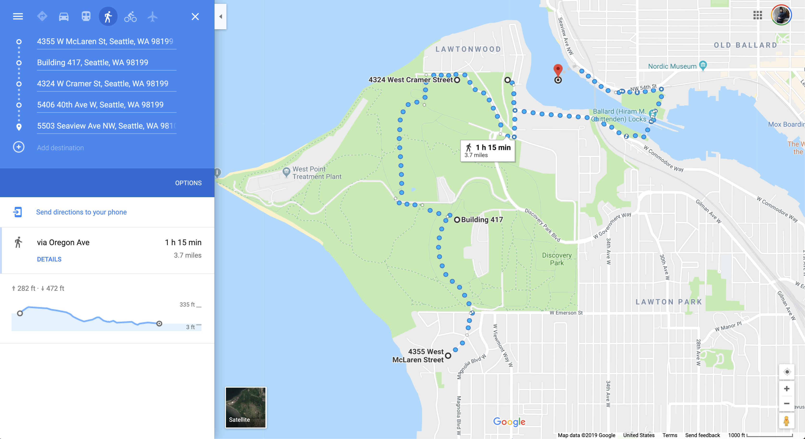

# Stroll

[](https://nbbj-digital.github.io/stroll/) [](docs/README.md) [](samples/strollSamples.js) 

[](https://www.npmjs.com/package/@mitevpi/stroll) [](https://bundlephobia.com/result?p=@mitevpi/stroll)

   

TT AEC Hackathon 2019 - Seattle Project

This is a computational library which finds the most nature-filled walks/paths to take thrughout the day in order to stimulate creativity and boost mental health.

Pathfinding is performed via Weighted Graph computation, with weights being given for characteristics such as proximity to parks, and amount of nature in the field of view.

## Proof of Concept

For the proof of concept application, we were not able to complete the functionality of a walk being a "loop", but we do calculate and find the most nature-filled walk given the input parameters and start point.



## Usage

To use this module, install locally using the command below, or clone this repository and import the .js files directly from source.

```cmd
npm i @mitevpi/stroll
```

### Environment Variables

Before using this module, `GMAPS_KEY` and `YELP_KEY` environment variables must be set on your machine with your specific Google Maps API Key and Yelp API Key.

### Imports

Imports can be done through the aggregating index.js file or via individual members.

```js
const Stroll = require('./index.js'); // from source
const stroll = require('@mitevpi/stroll') // from npm
```

```js
// from source
const ColorParse = require('./ColorParse');
const YelpData = require('./YelpData');
const WeatherData = require('./WeatherData');
const RouteData = require('./RouteData');

// from npm
const { RouteData } = require('@mitevpi/stroll');
const { ColorParse } = require('@mitevpi/stroll');
```

### Methods

#### Pathfinding Data

Building graphs and calculating paths of travel.

```js

// Create a custom grid around a origin lat/long
let grid = RouteData.GetPointGrid(47.660273, -122.409887, 1, 0.5);

RouteData.GetGraph(grid, 0.7) // get a graph from point grid
  .then(graph => RouteData.FindNaturePaths(graph)) // find all possible paths
  .then(paths => RouteData.FindTopNaturePaths(paths)) // return sorted paths
  .then(results => {
    console.log(results); // do something with results
  }).catch(err => console.error(err));
```

#### Yelp Data

Yelp data for nearby public parks/green amenities. Used for finding public parks and other notable green spaces near any point on earth (lat/long).

```js
YelpData.ParkSearch(47.660273, -122.409887, 1000).then(results => {
  console.log(results);
});
```

#### Weather Data

Weather data analysis. Currently not used in the nature score calculation, but itended to be added.

```js
let sunData = WeatherData.GetSunPositionToday(47.6694956, -122.31547389999999);
console.log(sunData);
```

#### Color Palette Analysis

Color palette analysis in field of view. Used for calculating how much of the visible color palette at any point on earth (lat/long) is green (nature).

```js
ColorParse.GetPalette(46.414382, 10.013988, 151.78).then(colors => {
  console.log(colors);
});
```

```js
ColorParse.GetPaletteNames(46.414382, 10.013988).then(names => {
  console.log(names);
})
```

```js
ColorParse.GetPaletteAnalysis(47.660259, -122.408417).then(result => {
  console.log(result);
})
```

## Development

### Building

The module can be built by running `npm pack` in the root directory of this repository. Documentation can be built using the Documentation module from npm, and by running `npm run doc` in the root directory of this repository.

### Testing

Testing is handled using [mocha](https://www.npmjs.com/package/mocha) and code coverage is evaluated using [nyc](https://www.npmjs.com/package/nyc). Tests can be initiated by running `npm test` in the root directory of this repository.